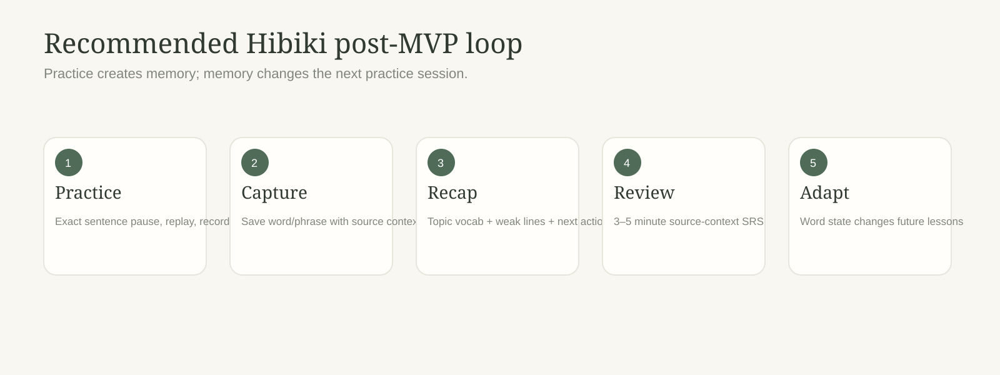
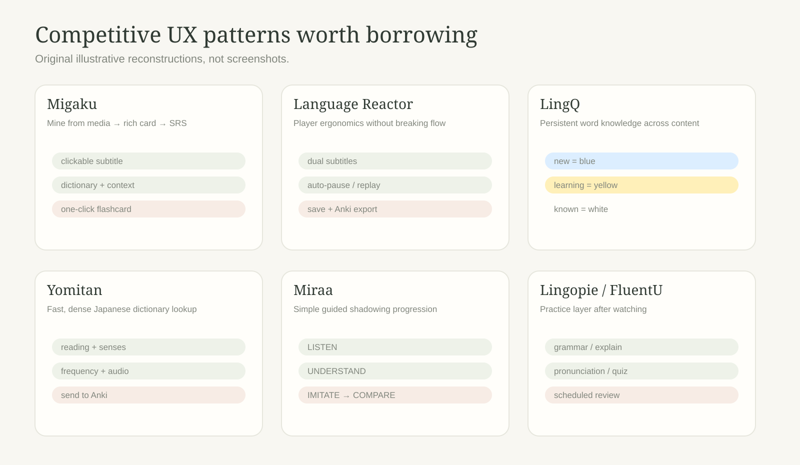
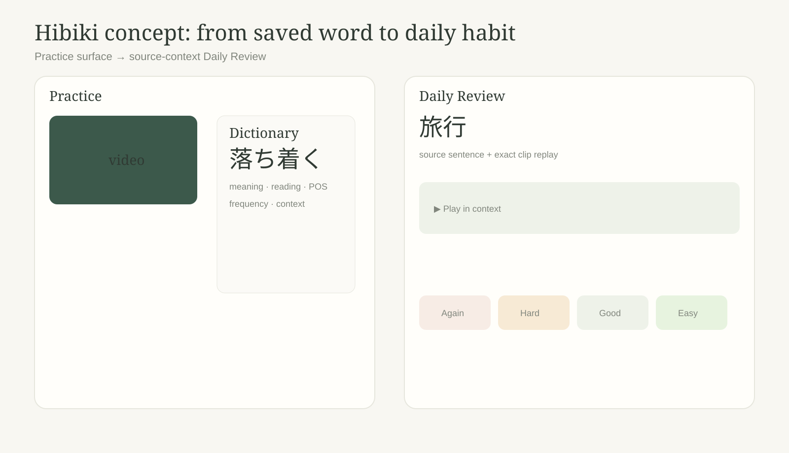

# Hibiki post-MVP competitive feature roadmap

> Research snapshot: 6 October 2026.  
> Scope: products in or adjacent to immersive video learning, Japanese sentence mining, shadowing, contextual vocabulary capture and review.

Hibiki already has a differentiated core: sentence-precise pause/replay, recording and A/B comparison, Shadowing Match, AI subtitle generation, Personal Dictionary, end-of-video topic vocabulary, comprehension checking, difficulty analysis and progress. The strongest competitors do not mainly win by having another player control. They win by making each encounter persist into the next session.

The core recommendation is therefore:

**Do not widen Hibiki first. Close the learning loop.**

## Executive summary

The largest post-MVP gap is **retention after the video**.

The mature products reviewed repeatedly connect four things:

1. What the learner encountered.
2. What the learner knows or is still learning.
3. What is due for review today.
4. What content or sentence is appropriate next.

That suggests a build order for Hibiki:

- **Phase A — close the retention loop:** decks/tags, Daily Review/SRS, source-context replay, export and a stronger end-of-video handoff.
- **Phase B — make immersion adaptive:** dictionary-grade lexical data, word knowledge states, personal comprehension and "good sentence to learn" recommendations.
- **Phase C — deepen the speaking moat:** actionable Shadowing Match diagnostics and explicit drill/loop presets.
- **Phase D — discovery and broader retention:** My Library, weekly reports, personal recommendations and optional transcript-grounded conversation.

### Where Hibiki is already stronger

- Shadowing is the primary interaction rather than a secondary tool inside a generic video-learning product.
- Hibiki owns the section player and can therefore keep replay, pause and continuation semantics deterministic.
- Record-and-compare is native to the practice loop.
- Local-first handling of personal media and recordings is a trust advantage.
- Personal Dictionary + topic vocabulary + exact section links already provide much of the data foundation required for a strong review system.

## Competitor scan

The diagram above is an original reconstruction of the recurring interaction patterns, not a screenshot or pixel-for-pixel recreation.

### Migaku — best end-to-end sentence-mining loop

Migaku makes subtitles and webpages interactive, combines real dictionaries with contextual AI help, tracks word knowledge, estimates content difficulty from what the learner knows, creates media-rich flashcards in one click, and schedules those cards with spaced repetition. Its video play modes can also change subtitle visibility and automatic pausing based on learner state. Recent releases add a Watch & Listen hub with recommendations, a catalog and Continue Watching.

**What Hibiki should take:** persistent word knowledge, context-rich cards/review, and personal content comprehension. The broad reader/OCR/podcast suite is useful later, but not the next priority.

Sources: [Migaku features](https://migaku.com/faq/features), [Migaku changelog](https://migaku.com/blog/changelog).

### Language Reactor — best intensive-viewing ergonomics

Language Reactor layers dual subtitles, one-key subtitle navigation, automatic pause, dictionary lookup, phrase/word saving and source replay over Netflix and YouTube. Saved items preserve context and can be exported to Anki; its tips explicitly support jumping from a saved item back to the moment in the source video.

**What Hibiki should take:** subtitle-reveal presets, fast context replay and export. Hibiki should keep its more deliberate shadowing semantics rather than copying every browser-player interaction.

Sources: [watching videos](https://dev.languagereactor.com/help/basic), [exports](https://www.languagereactor.com/help/export), [tips](https://dev.languagereactor.com/help/tips).

### LingQ — best persistent vocabulary model

LingQ makes vocabulary state visible everywhere. New words are highlighted, saved/learning words remain highlighted across future lessons, known words become unhighlighted, and the state can be changed during reading or review. It combines that with SRS, a vocabulary view, imports and progress statistics.

**What Hibiki should take:** a global Unknown / Learning / Known / Ignored model that follows the learner between videos. This is the cleanest prerequisite for truly personal difficulty and recommendations.

Sources: [LingQ iOS reader and vocabulary workflow](https://www.lingq.com/en/ios-app-support/), [YouTube importing](https://www.lingq.com/blog/youtube-videos-into-lingq/).

### Yomitan — best Japanese lookup speed and depth

Yomitan’s core advantage is low-friction dictionary depth: compact lookup, multiple dictionaries, reading, frequency information, native audio, examples, deinflection, and highly configurable Anki export. Its Anki template fields can include sentence context, source URL, frequency, screenshots and audio.

**What Hibiki should take:** dictionary-first term lookup rather than treating machine translation as the primary lexical definition. Translation remains valuable for sentence context.

Sources: [Yomitan overview](https://yomitan.wiki/), [Anki integration](https://yomitan.wiki/anki/).

### Lingopie — best TV-first practice layer

Lingopie combines dual subtitles with Grammar Coach, automatic subtitle looping, auto-pause, playback speed and "Say It!" recording with an immediate pronunciation score. Its Explain Sentence / Grammar Tutor adds a structured grammar/meaning panel without leaving the show.

**What Hibiki should take:** sentence explanation and explicit repeat presets. A licensed streaming catalogue is much less attractive as a near-term investment.

Sources: [video features](https://help.lingopie.com/support/solutions/articles/150000076263-how-to-use-video-features-on-lingopie-), [Grammar Tutor](https://help.lingopie.com/support/solutions/articles/150000174278-lingopie-grammar-tutor).

### FluentU — best watch → quiz → review progression

FluentU uses interactive subtitles, richer word pages/examples, personalized quizzes/flashcards and a "Ready for Review" SRS queue. Its curated content model makes the next lesson easy to choose.

**What Hibiki should take:** the explicit review funnel and the concept of promoted/featured vocabulary. The editorial catalogue itself is costly to reproduce.

Sources: [how FluentU works](https://www.fluentu.com/help/how-do-i-use-fluentu/), [SRS](https://www.fluentu.com/help/what-is-the-fluentu-srs-spaced-repetition-algorithm/).

### Miraa — clearest shadowing mental model

Miraa explicitly presents language shadowing as Listen → Understand → Imitate → Compare, supported by bilingual transcription, real-time translation and AI explanation.

**What Hibiki should take:** clearer stage language and an optional hands-free drill preset. Hibiki already owns the stronger sentence-precise mechanics underneath.

Sources: [Miraa](https://miraa.app/), [App Store](https://apps.apple.com/gb/app/miraa-ai-transcribe-shadow/id6462883096).

### Todaii — best Japanese-specific study wrapper

Todaii combines N5–N1 content, one-touch lookup, pronunciation practice/scoring, lesson-derived vocabulary and flashcards, listening/podcasts, AI conversation and learning reports.

**What Hibiki should take:** Japanese-specific level controls and a calm learning report. It should not drift into becoming a broad JLPT test-prep product.

Source: [Todaii App Store listing](https://apps.apple.com/gb/app/todaii-learn-japanese-n5-n1/id1107177166).

## Prioritized post-MVP feature list

### P0 — Daily Review / SRS

**Borrowed from:** Migaku, FluentU, LingQ, Lingopie, Todaii.

**UX:** Home and Dictionary show a small due count. A review card contains term, reading, meaning reveal, source sentence, source translation and "Play in context". Answer with Again / Hard / Good / Easy. A useful session should take 3–5 minutes and end with a short summary.

**Why this improves Hibiki:** Personal Dictionary becomes a learning system instead of storage. Hibiki already stores the source context/timestamp required to make its cards materially better than generic flashcards.

**Effort:** Medium.

### P0 — Decks, tags and "Save to review"

**Borrowed from:** Migaku, FluentU, Yomitan.

**UX:** Every save goes to an Inbox deck by default. The save panel can optionally select a deck/tag. Dictionary gains bulk actions and filters. End-of-video topic vocabulary can add selected words to a deck in one action.

**Why:** Organizes saved items before SRS grows and preserves a clean seam for future topic/class decks.

**Effort:** Small–Medium.

### P0 — Context-rich export / Anki interoperability

**Borrowed from:** Yomitan, Language Reactor.

**UX:** Export selected/all saved items as TSV/CSV first with term, reading, gloss, source sentence, translation, video title, URL and exact timestamp. Add AnkiConnect or APKG later if demand is strong.

**Why:** Low engineering cost, high credibility with serious learners, and no ecosystem lock-in.

**Effort:** Small.

### P0 — End-of-video action recap

**Borrowed from:** Migaku study summaries, Todaii learning reports.

**UX:** Extend the existing topic-vocabulary completion screen with average Shadowing Match, quiz result, weak sections, topic words and saved items. One main CTA: **Add selected to review**.

**Why:** Converts lesson completion into a concrete next action using features Hibiki already computes.

**Effort:** Small–Medium.

### P1 — Rich Japanese dictionary engine

**Borrowed from:** Yomitan, Migaku, Todaii.

**UX:** Instant lemma, reading, part of speech, multiple dictionary senses, commonness/frequency band, examples and native audio where licensing permits, plus a "meaning in this sentence" field. DeepL remains a sentence/context fallback rather than the sole lexical definition.

**Why:** Improves save quality and reduces dependence on generative/API semantics for simple dictionary questions.

**Effort:** Medium.

### P1 — Word knowledge states + cross-video highlighting

**Borrowed from:** LingQ, Migaku, Language Reactor.

**UX:** Every lemma can be Unknown / Learning / Known / Ignored. State appears with subtle text treatment and follows the learner into every transcript. Dictionary gets a bulk Word Browser.

**Why:** The product becomes cumulative. This is the prerequisite for personalized content difficulty and recommendations.

**Effort:** Medium–Large.

### P1 — Personal comprehension + "good line to learn" recommendations

**Borrowed from:** Migaku, LingQ.

**UX:** Before/during a lesson, show an estimated known-vocabulary coverage such as "You know ~84% of the vocabulary in this video." A transcript filter surfaces clean lines with one unknown/high-value word and reliable timing.

**Why:** Answers two important questions: "Is this video right for me?" and "Which lines deserve deliberate practice?"

**Effort:** Large.

### P1 — Explain sentence / Grammar Coach

**Borrowed from:** Lingopie, Migaku, Miraa, Todaii.

**UX:** An Explain action under the current sentence opens natural meaning, chunked structure, grammar points, particle roles, nuance/register and a literal breakdown. Cache by transcript key + segment ID.

**Why:** Grammar blockers stop forcing the learner out of the shadowing loop.

**Effort:** Medium.

### P1 — Explicit drill presets / hands-free shadowing modes

**Borrowed from:** Migaku, Language Reactor, Lingopie, Miraa.

**UX:** Named explicit presets such as:
- Focus — target only + pause.
- Support — translation available after the first pause.
- Drill — replay twice + record.
- Continuous — current existing continuous flow.

Repeat count, pause behavior and reveal behavior must remain visible settings; do not introduce hidden timing compensation.

**Why:** Reduces clicks and makes longer practice sessions possible while preserving Hibiki’s deterministic playback philosophy.

**Effort:** Medium.

### P1 — Review in source context everywhere

**Borrowed from:** Language Reactor, Migaku, Yomitan.

**UX:** Every saved/review item gets Play in context and an exact-section deep link. A review card can play only the saved line and automatically return to the card.

**Why:** Source context is Hibiki’s strongest stored asset. It should be available from every review surface.

**Effort:** Small.

### P2 — Shadowing Match v2: actionable diagnostics

**Borrowed from:** Lingopie Say It!, Todaii pronunciation practice, Miraa Compare.

**UX:** Keep the current aggregate score, but show recognized/aligned chunks versus omissions/substitutions, pacing difference, and recent section trend. Feedback must describe what the recognizer heard rather than pretending to be a phonetic diagnosis.

**Why:** Makes Hibiki’s speaking signal useful rather than merely motivational.

**Effort:** Medium.

### P2 — My Library / Continue Watching / Queue

**Borrowed from:** Migaku, LingQ, Language Reactor.

**UX:** Home becomes a lightweight personal library with Continue Watching, queued links, completion, personal difficulty/comprehension, saved-word count and review due count.

**Why:** Reduces setup friction without requiring a licensed catalogue.

**Effort:** Medium.

### P2 — Weekly report + daily goal

**Borrowed from:** Todaii, LingQ, Migaku.

**UX:** In-app weekly report: minutes practised, sections shadowed, review retention, saved/learned terms, average Shadowing Match and content level. Add an optional calm minutes/sections goal rather than punitive streak mechanics.

**Why:** Adds a retention surface that fits Hibiki’s tone.

**Effort:** Medium.

### P2 — Level-aware content recommendations

**Borrowed from:** Migaku, LingQ, Lingopie, FluentU.

**UX:** Recommend public/subtitled YouTube items from personal vocabulary coverage + transcript difficulty. Label items Comfortable / Stretch / Hard and explain why.

**Why:** Solves discovery after word-state data becomes reliable, without licensed Netflix-style content operations.

**Effort:** Large.

### P3 — Discuss this video in Japanese

**Borrowed from:** Language Reactor Aria, Todaii Tomo, Miraa.

**UX:** After completion, offer 2–3 transcript-grounded prompts. The learner answers via text or voice and gets naturalness/correction feedback linked back to relevant source lines.

**Why:** Good transfer from imitation to free production, but generic AI conversation is less differentiated than Hibiki’s shadowing + contextual review loop.

**Effort:** Medium–Large.

### P3 — Reader / podcast / OCR capture

**Borrowed from:** Migaku, LingQ.

**UX:** Share a webpage or podcast into Hibiki and feed it through the same lookup/review model. OCR/photo can come later.

**Why:** Broaden only after the video retention loop is proven.

**Effort:** Large.

## Proof of concept

The intended UX change is a continuous loop rather than separate feature pages:

1. **During practice:** tap/select → dictionary-first lookup → Save; choose a deck only if desired.
2. **At completion:** recap combines topic vocabulary, weak sections, Shadowing Match/quiz outputs and one next action.
3. **Next visit:** a small due count starts a 3–5 minute Daily Review where every item retains its source sentence and exact video context.
4. **Future videos:** Known/Learning state changes transcript display, personal comprehension estimates and recommendations.

## Recommended build order

### Phase A — close the retention loop

Build:
- Decks/tags.
- Daily Review/SRS.
- Play in context from review.
- CSV/TSV export.
- End-of-video "Add selected to review".

This creates the strongest daily-return reason with the smallest amount of new product surface.

### Phase B — make immersion adaptive

Build:
- Rich dictionary.
- Word states.
- Word Browser / bulk status.
- Personal comprehension.
- One-unknown-word / high-value sentence recommendations.

This is where Hibiki stops treating each video as a fresh session.

### Phase C — deepen the speaking moat

Build:
- Shadowing Match diagnostics.
- Explicit drill presets.
- Per-section recent trend.

Keep this calibration-driven. Do not silently change the meaning of the current score or add pitch-accent/phoneme claims without a separate validation effort.

### Phase D — discovery and broader retention

Build:
- My Library / Continue Watching.
- Weekly learning report.
- Personal content recommendations.
- Optional transcript-grounded conversation.

These features become materially better after Hibiki has reliable learner-state data.

## Monetisation fit

- Keep the fundamental memory loop — basic decks, local SRS, word states and export — genuinely useful on **Free**. Saving vocabulary but paywalling the ability to remember it would feel adversarial.
- **Pro** is a natural home for variable-cost features: AI subtitle generation, Shadowing Match analysis, sentence/grammar explanations, advanced content analysis/recommendations, richer cloud-backed history and future AI conversation.
- The best upgrade surface is after demonstrated value, for example after the learner sees a useful review queue or a personal vocabulary-coverage preview.

## What not to copy yet

1. **Licensed streaming catalogue:** Lingopie-style rights/content operations would dominate the roadmap.
2. **Large editorial catalogue:** FluentU-style hand-curation is expensive and not Hibiki’s differentiation.
3. **Generic AI companion first:** easy to add, hard to differentiate.
4. **Full reader/OCR/podcast parity:** broaden only after the video retention loop is strong.
5. **Aggressive streak mechanics:** a calm goal/report surface better matches Hibiki.
6. **Unvalidated pitch/phoneme grades:** keep pronunciation claims evidence-bounded.

## Source list

- [Migaku — Features](https://migaku.com/faq/features)
- [Migaku — Changelog](https://migaku.com/blog/changelog)
- [Language Reactor — Watching Videos](https://dev.languagereactor.com/help/basic)
- [Language Reactor — Export](https://www.languagereactor.com/help/export)
- [Language Reactor — Tips](https://dev.languagereactor.com/help/tips)
- [LingQ — iOS Reader / Vocabulary](https://www.lingq.com/en/ios-app-support/)
- [LingQ — YouTube Import](https://www.lingq.com/blog/youtube-videos-into-lingq/)
- [Yomitan — Overview](https://yomitan.wiki/)
- [Yomitan — Anki Integration](https://yomitan.wiki/anki/)
- [Lingopie — Video Features](https://help.lingopie.com/support/solutions/articles/150000076263-how-to-use-video-features-on-lingopie-)
- [Lingopie — Grammar Tutor](https://help.lingopie.com/support/solutions/articles/150000174278-lingopie-grammar-tutor)
- [FluentU — How to use FluentU](https://www.fluentu.com/help/how-do-i-use-fluentu/)
- [FluentU — Ready for Review SRS](https://www.fluentu.com/help/what-is-the-fluentu-srs-spaced-repetition-algorithm/)
- [Miraa](https://miraa.app/)
- [Miraa — App Store](https://apps.apple.com/gb/app/miraa-ai-transcribe-shadow/id6462883096)
- [Todaii — App Store](https://apps.apple.com/gb/app/todaii-learn-japanese-n5-n1/id1107177166)

Research note: feature descriptions reflect public product/help information reviewed on 6 October 2026. Interfaces change quickly; the roadmap focuses on durable interaction patterns rather than copying a specific layout. The competitor visuals in this document are original illustrative reconstructions rather than screenshots.
