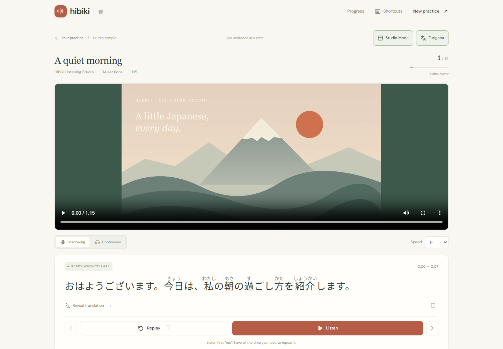
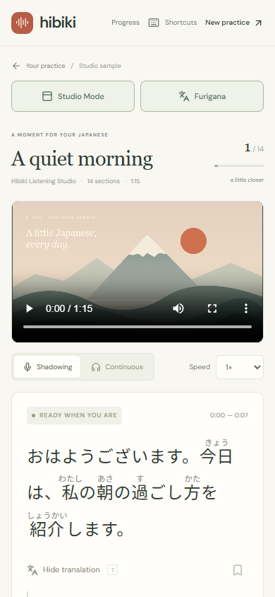

# Studio Mode / Furigana verification — 2026-10-04

Both display features extend the existing mounted practice implementation. Preferences persist in `hibiki:v1:preferences` as `studioMode` / `furigana`, with false defaults and safe older-preference loading. Playback adapters, canonical Lesson/Segment data, shared D1 schema/cache identity, quiz/difficulty generation and learner IDs are unchanged by this feature.

## Exact feature files changed

- `.gitignore`
- `PROJECT_CONTEXT.md`
- `README.md`
- `eslint.config.mjs`
- `package.json`
- `package-lock.json`
- `scripts/prepare-furigana.mjs`
- `src/app/globals.css`
- `src/components/practice.tsx`
- `src/components/comprehension-quiz.tsx`
- `src/components/japanese-text.tsx`
- `src/lib/storage.ts`
- `src/lib/japanese-readings.ts`
- `src/lib/furigana-client.ts`
- `src/lib/furigana-worker.ts`
- `tests/preferences.test.ts`
- `tests/japanese-readings.test.ts`
- `tests/furigana-client.test.ts`
- `tests/e2e/display-preferences.spec.ts`
- `docs/studio-furigana.md`
- `docs/studio-furigana-verification.md`
- `docs/images/studio-desktop.png`
- `docs/images/studio-mobile.png`

Generated `public/furigana/v1/` assets are ignored and prepared automatically by the npm dev/build hooks. The generated `next-env.d.ts` was restored to its prior state and is not a feature change.

## Dependency and bundle measurements

Pinned Kuromoji 0.1.2 uses Apache-2.0; its bundled IPADIC/NAIST/ICOT notices are copied with the static assets. esbuild 0.28.2 is an explicit development build dependency already present transitively in the stack.

The dictionary totals **17,791,956 bytes**, already gzip-compressed. The browser parser is **307,967 bytes**, **67,763 bytes gzip**. The lazy vinext reading client is **801 bytes / 484 gzip**, and the compiled worker is **1,185 bytes**. These optional assets enter neither the initial application JavaScript nor the server Worker bundle. The small renderer/toggle code enters the ordinary practice bundle. The browser test explicitly observes no `/furigana/` asset requests with Furigana disabled.

All reading work runs in a browser worker after enabling Furigana. Duplicate/in-flight requests share a canonical-string promise cache, bounded to 2,000 entries. Plain text remains usable on missing assets; retries and stale-result cancellation are covered. The first enable requires the self-hosted dictionary assets unless cached; offline first-use readings cannot initialize. There is no AI, paid service, external reading API or hosted annotation cache.

## Reading examples and identity proof

The real dictionary produces `日本語 → にほんご`, `勉強 → べんきょう`, `今日 → きょう`, `天気 → てんき`, `食べました → <ruby>食<rt>た</rt></ruby>べました`, and `大丈夫 → だいじょうぶ`. [Full semantic output examples](studio-furigana.md#deterministic-readings) include punctuation and plain kana.

`tests/japanese-readings.test.ts` compares the complete serialized lesson, shared `transcriptHash`, SHA-256 `transcriptKey` and `transcriptRevision` before/after annotating all demo segments and quiz question/option/evidence strings. It revalidates the original quiz with exact evidence unchanged. No derived fields appear on any segment. Browser tests compare stored lesson/quiz/difficulty/completion artifacts byte-for-byte across toggles, retain quiz answers, use canonical search, and check screen-reader names and Chrome selection contain only base text.

## Checks

| Check | Result |
| --- | --- |
| Unit/regression tests | 119 passed, including 8 new reading/preference/cache tests |
| Full Playwright — Next production | 41 passed (35 existing + 6 new) |
| Full Playwright — built Cloudflare preview | 41 passed (35 existing + 6 new) |
| Final display + quiz checks after replay-scroll/accessibility fixes | 10 passed on each runtime |
| Built Worker + native local D1 check | Passed: captions/quiz/difficulty miss → save → hit, providers called once |
| ESLint | Passed, 0 errors; four existing warnings in difficulty/quiz files |
| Typecheck | Passed (Next route types, application, relay Worker) |
| Next production build | Passed |
| vinext/Cloudflare production build | Passed; existing vinext shim/chunk/classification notices remain |
| Git whitespace check | Passed |

Browsers use installed Chrome, with the real MediaRecorder and a fake microphone source. Cloudflare preview uses the built production bundle with `CLOUDFLARE_VITE_FORCE_LOCAL=true` and unused test-only secret placeholders; it does not need live AI credentials. Provider/network flows in deterministic browser tests remain mocked where existing tests require it. Actual local D1 and workerd are exercised independently.

## Layout evidence and remaining limits

The desktop/mobile screenshots below show Studio Mode and Furigana together. The e2e suite also records normal mode, Studio with readings off/on, translation hidden/revealed, and long text at 1440, 820, 390 and 320 pixels; no horizontal overflow or clipped readings. It verifies current text is inside a 1366×768 laptop viewport, all panels remain scrollable, and evidence replay scrolls to the wide player.

Kuromoji/IPADIC can misread context-dependent homographs, proper names, new vocabulary or unusual orthography. Unknown words remain unannotated. Kana alignment preserves okurigana when unique, otherwise annotates the whole dictionary token. The substantial optional download and dictionary memory are the tradeoff for general morphological coverage rather than a tiny authored word list. Partial ruby selection/copy may differ by browser; Chrome's base-only selection is tested. Mobile tests use browser viewport emulation, not physical device testing.
