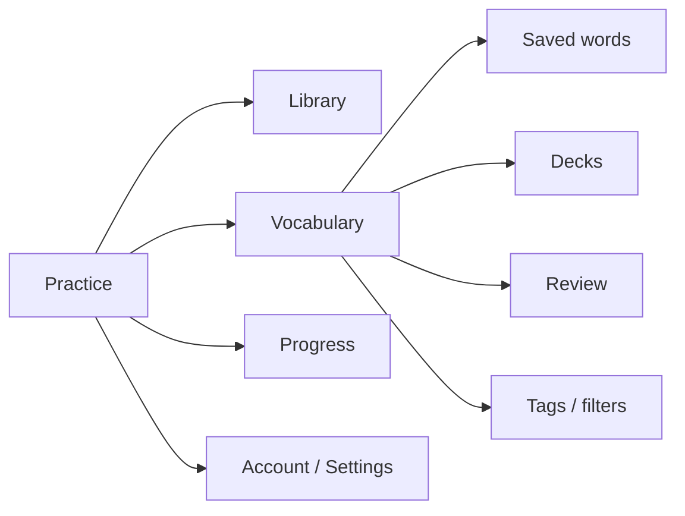
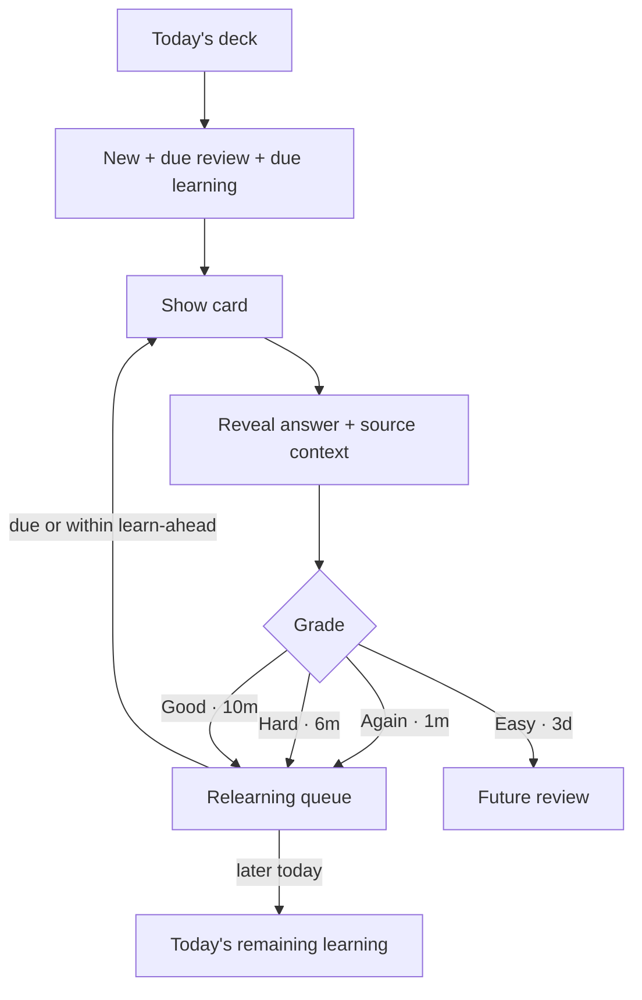

# Hibiki / Shadowing UX Audit

**Status:** Active audit checkpoint — code/UX review substantially complete; live browser verification is blocked from the current audit runtime  
**Audit date:** 2026-10-06  
**Deployed app:** https://shadowing.julianpopovskijones.workers.dev/  
**Primary requested test video:** https://shadowing.julianpopovskijones.workers.dev/practice/youtube-kWl7muWnuM0

## Scope and evidence

This is a documentation-only UX audit. No application code is changed in this branch.

Evidence is labelled so a later agent can resume without confusing observed behaviour with inference:

- **[USER-LIVE]** — issue directly observed/reported by the product owner on the deployed build.
- **[CODE]** — behaviour confirmed in the current `main` implementation.
- **[COMPETITOR]** — interaction pattern supported by current public competitor/help documentation.
- **[VERIFY-LIVE]** — should be checked in an interactive browser before implementation sign-off.

### Runtime limitation

The deployed `workers.dev` host could not be reached from the web/container runtime available to this audit. Both the home URL and requested YouTube practice URL failed before page content could be loaded. The supplied Pro test account therefore could **not** be used from this runtime. I have not invented click-through observations.

The audit instead:
1. preserves the product owner's live observations;
2. traces the exact current route/component/scheduler implementation;
3. compares the resulting flows against established language-learning and SRS patterns;
4. records live-only checks separately for a future browser-enabled pass.

## Executive summary

The strongest part of Hibiki is the actual **practice loop**: source video, section-level listening, pause/continue semantics, transcript navigation, recording and contextual vocabulary. The weakest part is everything around that loop.

The highest-value UX changes are:

1. **Unify vocabulary, decks and review into one coherent learning system.** The current Dictionary / Words / Review split exposes implementation concepts rather than a learner-centred workflow.
2. **Replace the current review scheduler/session UX with true intraday learning/relearning steps and visible answer intervals.** The current scheduler is materially different from Anki-style behaviour, not just visually different.
3. **Make Japanese lookup operate on meaningful inflected spans.** A click should not reduce `話せます` to a fragment such as `話`.
4. **Simplify Studio controls through hierarchy/progressive disclosure.** Advanced timing/drill settings currently compete with the core Listen → Speak → Continue loop.
5. **Make navigation and theming systemic.** Account, Dictionary, Words and Review do not share the same app shell as Home/Practice/Progress, while dark-mode inconsistencies have been observed in the deployed practice dictionary surface.
6. **Turn Progress into guidance, not telemetry.** The current page contains useful data but uses many diagnostic/implementation-oriented labels and does not make the next action prominent.
7. **Demote manual sync.** Sync already starts automatically in code; “Sync now” should be an advanced recovery action, not a primary account control.

---

# Findings by section

## 1. Global navigation / information architecture

### P0 — Use one persistent app shell on every signed-in product surface
**Evidence:** [CODE]

Home, Practice, Library and Progress render the shared `Header`. Account, Dictionary, Words and Review instead render standalone pages with only an `HIBIKI` eyebrow link to `/`.

**Problem:** users lose orientation and interpret these pages as dead ends. This exactly explains the reported “no back button” problem without requiring separate back-button fixes on every page.

**Implementation task:**
- Render the same global app shell on Account, Vocabulary/Dictionary, Review and Words.
- Preserve a clear current-location state.
- On small screens collapse the large navigation set into a compact menu rather than wrapping many links onto multiple lines.
- Do not rely on the logo/eyebrow as the only way back.

### P0 — Reduce top-level navigation concepts
**Evidence:** [CODE]

The header currently exposes Account, Review, Library, Progress, Dictionary, Words, Help/Shortcuts, theme and a practice CTA. “Dictionary” and “Words” are two adjacent top-level vocabulary destinations with overlapping responsibilities.

**Recommendation:** target top-level IA closer to:

Use **Vocabulary** as the learner-facing parent concept. “Dictionary” is a tool inside vocabulary/practice; “Words” is not a sufficiently distinct top-level destination.

### P1 — Standardise page-level return behaviour
**Evidence:** [USER-LIVE] [CODE]

Where a full app shell is intentionally omitted (auth/reset flows), use an explicit **Back to Hibiki / Continue practising** affordance with conventional placement and iconography.

---

## 2. Home / starting a practice

### P1 — Make the primary start flow dominant and move secondary media actions out of competition
**Evidence:** [CODE]

The home start card contains the main video URL action, Import media/subtitles, queue-for-later, processing stages and fallback/error actions. The core action is good, but the secondary paths accumulate quickly once a URL is entered.

**Implementation task:**
- Keep **Paste link → Start shadowing** as the primary path.
- Treat **Import media/subtitles** and **Queue for later** as secondary actions with lower visual weight.
- Validate a queued URL before showing “Saved to your queue”; avoid storing arbitrary text as a “video”.
- Preserve the current staged preparation feedback and cancel action; these are good patterns.

### P1 — Make failures action-specific
**Evidence:** [CODE]

Current fallback messaging can offer “Import a transcript” or “Try the demo” after preparation failure.

**Recommendation:** distinguish:
- video could not be resolved;
- video resolved but no Japanese subtitles exist;
- subtitle retrieval failed temporarily;
- imported media requires subtitles;
- Pro auto-generation is available.

This reduces the impression that every failure means “upload a transcript”.

---

## 3. Import / subtitle generation

### P1 — Keep the explicit subtitle choice; improve the decision copy
**Evidence:** [CODE]

The current dialog correctly requires a choice between **Upload own subtitles** and **Auto-generate subtitles** and never silently auto-generates. Keep this.

**Improve:**
- Explain in one line under each option what the user needs and what will happen.
- For link-based generation, surface early that the user must provide the matching audio/video file for transcription; currently that requirement only becomes evident after selecting generation.
- When Pro is required, let Free users see the option and explanation, but avoid a disabled control that feels broken. Use a clear locked/upgrade state.
- Show privacy/location of processing beside generation, not buried later.

### P2 — Revisit the 250 MB upload message
**Evidence:** [CODE]

The dialog presents “up to 250 MB” as a generic media limit. If media remains local for playback but transcription/upload has different constraints, separate those concepts so users do not infer the media is necessarily uploaded to the server.

---

## 4. Main Practice / Studio Mode

### P0 — Make meaningful Japanese expressions the default lookup target
**Evidence:** [USER-LIVE] [CODE]

`JapaneseText` turns morphology tokens into individual clickable `LookupToken` elements using each token’s `surface_form`. This can make an inflected expression such as `話せます` behave like smaller parser fragments. Manual range selection can look up a larger phrase, but the default click path is the one users naturally try first.

**Implementation task:**
- On click, resolve a **candidate lexical span around the clicked token**, including attached inflection/auxiliary material where appropriate.
- Preserve both:
  - full surface text selected in the subtitle;
  - canonical dictionary lemma/readings.
- In the dictionary result show the relationship explicitly, e.g. **話せます → 話す**.
- Add small **expand / shrink selection** actions when multiple plausible spans exist.
- Never make users manually drag-select a normal inflected word just to get a useful lookup.
- Cover conjugated verbs, adjective inflections, auxiliaries, particles and multi-token expressions in tests.

### P0 — Make lookup usable on touch as well as mouse
**Evidence:** [CODE]

Phrase lookup is bound to `onMouseUp`; word tokens themselves are clickable, but the “select a phrase” affordance is desktop-centric. The visible hint literally says “Click a word or select a phrase”.

**Implementation task:**
- Support tap-to-lookup and a touch-friendly expand/shrink span mechanism.
- Rewrite instruction copy to device-neutral wording.
- Test iOS/Android text-selection behaviour and prevent browser selection chrome from fighting the app interaction.

### P0 — Fix theme coverage as a token/system problem, not one-off CSS
**Evidence:** [USER-LIVE] [CODE]

The deployed build has been observed showing white studio/dictionary surfaces and white text on white/light controls. Current styling mixes theme variables with many hard-coded greys/greens and component-specific dark overrides.

**Implementation task:**
- Move every interactive surface to semantic theme tokens: surface, elevated surface, text, muted text, border, selected, hover, focus, disabled, danger.
- Cover the dictionary panel, lexicon definitions, word-state controls, buttons, inputs/selects, recording/scoring cards and popovers.
- Add automated visual/theme assertions for **default, hover, selected, focus, disabled, loading and error** states in both themes.
- Treat WCAG contrast as an acceptance criterion, not merely “looks dark”.

### P0 — Simplify the control hierarchy below the media player
**Evidence:** [USER-LIVE] [CODE]

Below the player, the user can encounter:
- Shadowing / Continuous segmented mode;
- speed;
- timing offset with three buttons;
- Preset;
- source repeats;
- pause behaviour;
- translation behaviour;
- optional speaking-window numeric input;
- hands-free start/stop;
- current sentence controls;
- recorder/scoring.

These are powerful features, but too many controls are presented as peers.

**Recommended hierarchy:**
- **Primary row:** Shadowing / Continuous, speed.
- **Current-section card:** Replay, Listen/Continue, Previous/Next, Translate, Save.
- **Recording controls:** directly under current-section controls in Studio Mode.
- **Practice settings disclosure:** Preset, repeats, pause behaviour, translation reveal, timing offset.
- **Advanced timing:** offset should be clearly labelled as calibration/troubleshooting, not routine practice.

### P1 — Remove redundant mode/preset concepts
**Evidence:** [CODE]

The UI separately exposes **Shadowing vs Continuous** and a **Preset** dropdown whose options include Focus, Support, Drill and Continuous. Selecting a preset also changes mode.

**Problem:** two controls partially govern the same state.

**Implementation task:** choose one mental model:
- either **Mode** (Shadowing / Continuous) with an optional “Shadowing style” submenu;
- or **Practice style** (Focus / Support / Drill / Continuous) as the sole top-level control.

Do not show two overlapping mode selectors at the same hierarchy level.

### P1 — Make the compact dictionary result a popover/side panel with progressive disclosure
**Evidence:** [CODE]

The current lookup inserts a substantial `DictionarySavePanel` inline under the sentence. It includes dictionary senses, word state, source-sentence meaning, Reading, Meaning, Sentence meaning, Save, Add to review and View dictionary.

**Problem:** a quick lookup turns into a form-heavy workflow and can move the core playback controls vertically.

**Implementation task:**
- Default compact state: selected surface form, reading/lemma, top senses, word status, **Save**.
- Secondary actions: **Add to review**, edit meaning, sentence meaning, advanced dictionary detail.
- Keep the practice layout stable while lookup opens.
- On desktop use the available right-side/studio panel or anchored popover; on mobile use a bottom sheet/full-width drawer.
- Closing lookup returns focus to the selected Japanese expression.

### P1 — Make transcript-side Japanese interaction consistent
**Evidence:** [CODE]

The current sentence supports lookup; transcript rows render highlighted word-state information but do not pass an `onLookup` handler.

**Recommendation:** either:
- support the same lookup from transcript rows; or
- remove interaction-looking word highlights there and make the current sentence unmistakably the interactive study surface.

Consistency is more important than maximizing click targets.

### P1 — Reduce excessive tab stops in tokenised sentences
**Evidence:** [CODE]

Each lookup token becomes `span role="button" tabIndex=0`. A long sentence can therefore add many keyboard tab stops before the user reaches playback controls.

**Implementation task:** provide one sentence-level keyboard interaction or roving focus model rather than a tab stop for every word.

### P1 — Raise small functional text sizes
**Evidence:** [CODE]

Several practice and dictionary labels are 8–10 px, including state/metadata/instructions. Examples include `.small-label`, `.player-footnote`, `.translation-privacy`, dictionary hints and entry-source metadata.

**Acceptance criterion:** functional/secondary copy should normally render at a readable 12–14 px equivalent; reserve tiny eyebrow text for decorative labels only.

---

## 5. Vocabulary / Personal Dictionary

### P0 — Merge Dictionary + Word Browser into a single Vocabulary area
**Evidence:** [CODE]

Current concepts:
- **Personal Dictionary:** saved source-linked entries, tags, deck membership, review enrollment, export.
- **Word Browser:** all encountered/tracked lemmas, word state, recent occurrences, JMdict lookup, bulk status.

Both are useful; exposing them as two independent top-level pages is not.

**Proposed view:**
- **Saved** — source-linked words/phrases the learner deliberately kept.
- **All vocabulary** — encountered/tracked lemmas and Known/Learning/Ignored state.
- **Decks** — study collections.
- **Review** — due queue.
- Advanced **Tags / Export** under Manage.

### P0 — Replace the permanently crowded management toolbar
**Evidence:** [CODE]

The dictionary toolbar currently mixes Daily Review, deck filter, tag filter, search, tag CRUD, deck creation/deletion, add-to-review, membership actions and three export actions.

**Implementation task:**
- Default state should be browse/search/review, not administration.
- Show a contextual bulk action bar **only after selection**.
- Move **Create/manage decks**, **Manage tags**, and **Export** into dedicated views or overflow actions.
- Keep one prominent “Review due” CTA.

### P0 — Clarify the difference between Saved, Inbox and Review
**Evidence:** [USER-LIVE] [CODE]

Saving creates a dictionary entry. Review enrollment is a separate action that uses deck ID `inbox`. The UI then says “Saved to My Words · Inbox”, while the dictionary footer says “Saving keeps a word in Inbox. Add to review when you want to remember it.”

This is internally inconsistent: “Inbox” sounds both like where saved items live and like a review deck, while “Add to review” is separate.

**Recommendation:**
- Prefer **Saved words** as the automatic holding area.
- A word enters SRS only when **Learn / Add to review** is enabled.
- If a default deck is needed, call it **Default deck** or **Unsorted**, not Inbox, unless an inbox workflow is explicitly taught.
- Never imply a word is both “in Inbox” and “not in review” without explaining that distinction.

### P1 — Explain deck vs tag at the point of need
**Evidence:** [USER-LIVE] [CODE]

A `details` control currently says “Tags describe a word. Decks group reviews.” This is directionally correct but hidden inside a crowded management surface.

**Implementation task:**
- Deck = controls study grouping/settings.
- Tag = cross-cutting label/filter that does **not** affect scheduling.
- Give one short example for each.
- Tags should not be necessary for the normal review workflow.

### P1 — Replace per-entry deck checkbox sprawl
**Evidence:** [CODE]

`ReviewEntryActions` renders a checkbox for **every deck** on every dictionary entry.

**Problem:** this scales poorly and visually overwhelms entries as deck count grows.

**Replace with:** one “Deck: …” chooser or “Move/Add to deck” menu, with current memberships summarized as chips.

### P1 — Make destructive actions secondary and confirm when consequences are broad
**Evidence:** [CODE]

Delete deck and Remove entry are text actions adjacent to routine management. Ensure deck deletion explains whether cards are deleted, unscheduled, or merely ungrouped before committing.

---

## 6. Flashcards / Daily Review

### P0 — Implement true learning/relearning steps, not the current SM-2 approximation
**Evidence:** [USER-LIVE] [CODE] [COMPETITOR]

Current `review-scheduler.ts`:
- Again → 10 minutes;
- Hard on a new card → minimum **1 day**;
- Good on a new card → **1 day**;
- Easy on a new card → **4 days**;
- due cards are only those whose exact `dueAt <= now`.

Anki's current model exposes configurable learning steps (commonly minute-scale), previews the next interval on each answer, and can learn same-day cards ahead within its configured learn-ahead window.

**Implementation task:**
- Introduce explicit **learning** and **relearning** step arrays.
- Show the resulting interval on every answer before the user taps it.
- Calculate previews with the same scheduler function that will be committed on grading.
- Keep intraday steps in the session queue.
- Support a configurable learn-ahead window so a user can finish today's short learning steps in one sitting.
- Do not hardcode the UI to fixed example intervals; display scheduler output.

Suggested visual interaction:

### P0 — Reinsert Again/short-step cards into the active review session
**Evidence:** [CODE]

The current session stores a fixed list of up to 20 entry IDs and advances `index + 1` after grading. A card graded Again gets a new due time but is not automatically reinserted into the session.

**Acceptance criterion:** an intraday learning/relearning card must return when due, or be learned ahead according to session rules, without forcing the user to exit and restart review.

### P0 — Show answer interval previews on the buttons
**Evidence:** [USER-LIVE] [CODE] [COMPETITOR]

Replace:
- Again
- Hard
- Good
- Easy

with, for example:
- **Again** · 1m
- **Hard** · 6m
- **Good** · 10m
- **Easy** · 3d

Use actual scheduler output, not static text.

### P0 — Replace the hard-coded 20-card session with deck/global limits
**Evidence:** [USER-LIVE] [CODE] [COMPETITOR]

The review page always slices due cards to the first 20. Anki exposes new-card/day and maximum-reviews/day options and supports deck-specific presets/limits.

**Implementation task:**
- Global defaults for **new cards/day** and **review cards/day**.
- Optional per-deck override.
- Clearly distinguish **new**, **learning**, and **review** counts before session start.
- Do not arbitrarily hide overdue reviews because a session object was capped at 20.

### P0 — Make deck review the primary interaction, not card selection
**Evidence:** [USER-LIVE] [CODE]

Users should enter a deck and press **Study / Review today**. Individual checkboxes are a management tool, not the normal study-selection model.

### P1 — Play source context inline
**Evidence:** [USER-LIVE] [CODE] [COMPETITOR]

Current **Play in context** opens the full practice player in a new tab. This breaks review flow.

**Implementation task:**
- Embed a compact source player in the card.
- Seek to exact saved section and stop at section end.
- Provide replay and a **minimise/collapse** action.
- Restore keyboard focus to the review card after playback.
- Keep “Open full practice” as a secondary action.
- For unavailable private/local media, explain the reattach requirement inline without opening a dead destination.

### P1 — Separate primary context action from provenance
**Evidence:** [USER-LIVE] [CODE]

Visually separate:
- **Play context** (learning action)
from
- source title/timestamp and **Open source video ↗** (provenance/navigation).

### P1 — Add per-card furigana
**Evidence:** [USER-LIVE] [CODE]

Practice has a global Furigana preference; review cards show reading text but no per-card control.

**Implementation task:** add a card-level reading/furigana reveal that does not permanently alter the user's global practice setting. Preserve the chosen default in review settings.

### P1 — Add keyboard review shortcuts
**Evidence:** [COMPETITOR]

For desktop speed, support:
- Space/Enter: reveal;
- 1–4: Again/Hard/Good/Easy;
- R: replay context when available.

Show shortcuts subtly only after the answer is revealed.

---

## 7. Words / knowledge-state browser

### P0 — Remove implementation/debug language from the learner UI
**Evidence:** [CODE]

Examples currently visible:
- “optional Japanese morphology dictionary is an 18 MB download”
- “Lexical definitions load only the required JMdict shards”
- detailed explanation of state/sync semantics.

These are useful engineering facts, not primary learning copy.

**Implementation task:** move them to Help / Data & storage / Advanced. Default copy should answer:
- What is this page?
- What can I do here?
- What does each status mean?

### P1 — Enter a dedicated “Manage” mode for bulk checkboxes
**Evidence:** [CODE]

The Word Browser defaults to a table whose first column is selection and exposes bulk marking immediately.

**Recommendation:** default to a lightweight browse list. Enter **Manage** to reveal checkboxes and bulk state actions.

### P1 — Make word-state labels learner-centred
**Evidence:** [CODE]

“Unknown / Learning / Known / Ignored” is viable, but explain **Ignored** as “do not highlight / do not treat as learning target”, not as a judgment of the word.

---

## 8. Progress

### P0 — Turn the top of Progress into “what changed + what should I do next”
**Evidence:** [CODE]

Progress currently starts with Weekly Report plus many metrics and later sections for typical content, habits, lesson activity, attention moments and comprehension history.

**Problem:** the page is informative but lacks a decisive next action.

**Recommended top hierarchy:**
1. **This week:** minutes, sessions/sections, reviews, Shadowing Match.
2. **Today:** goal progress + reviews due.
3. **Next action:** Continue lesson / Review N words / Revisit 2 difficult sections.
4. Detailed history below.

### P1 — Replace internal/defensive metric labels with learner language
**Evidence:** [CODE]

Current labels/copy include:
- “Saved terms in device cache”
- “UTC practice days”
- “explicit section replays”
- long methodological disclaimers.

Keep methodological honesty, but move detail into **How this is calculated**.

Suggested labels:
- Saved words
- Practice days
- Sections replayed
- Review recall
- Recording attempts

### P1 — Use the user's local day boundary
**Evidence:** [CODE] [VERIFY-LIVE]

Weekly Report visibly says “UTC practice days”. For a London user (and especially users far from UTC), a daily goal and “today” should respect local calendar days unless there is a strong technical reason otherwise.

### P1 — Add trend visuals only when they answer a question
**Evidence:** [CODE]

Useful visual candidates:
- minutes practised by day;
- review recall over recent sessions;
- Shadowing Match recent trend;
- content difficulty range over time.

Avoid gamified charts with no actionability. Hibiki's calm tone is an asset.

### P2 — Make “moments that needed more attention” actionable
**Evidence:** [CODE]

Each attention item should have **Replay section** / **Practice again**, not merely show the timestamp and reasons.

---

## 9. Account / Settings

### P0 — Demote “Sync now”; sync is already automatic
**Evidence:** [USER-LIVE] [CODE]

`AccountBridge` starts account, review and knowledge sync globally. The account page still presents **Sync now** alongside ordinary account actions.

**Implementation task:**
- Default state: passive **Synced just now / Saved locally / Waiting for connection** indicator.
- Automatic retry remains invisible unless there is a problem.
- Put **Sync now** under Troubleshooting / Advanced.
- Only ask the user to intervene after an actionable sync error.

### P0 — Either make Account a settings hub or make it a panel
**Evidence:** [USER-LIVE] [CODE]

The current page is a narrow 540 px column containing email, plan, sign-in methods, sync status and action buttons.

Preferred full-page structure:
- Profile + plan.
- Learning preferences (furigana default, review defaults, practice defaults).
- Connected sign-in methods.
- Data & sync status.
- Export/privacy.
- Sign out / destructive account actions.

If those settings remain elsewhere, use an account drawer/panel instead of a sparse standalone page.

### P1 — Group actions by intent
**Evidence:** [CODE]

Do not mix “Sync now”, “Connect Google”, “Add email sign-in”, “Sign out”, “View progress” and “Personal dictionary” as two undifferentiated button rows.

Use sections: **Learning**, **Sign-in & security**, **Data & sync**, **Account**.

---

## 10. Library

### P1 — Make “Continue” the default value proposition
**Evidence:** [CODE]

The Library already has All / Continue watching / Completed / Saved filters, due-review link and recommendation infrastructure.

Improve by:
- placing **Continue** first when there is unfinished activity;
- showing the last section/time and one **Continue** CTA;
- showing review due as a separate daily task, not just another utility link.

### P1 — Simplify technical fit labels
**Evidence:** [CODE]

Phrases such as “explicitly Known” are precise but mechanical. Prefer:
- **Comfortable — ~84% familiar**
- **Stretch — ~72% familiar**
with an info affordance explaining the estimate.

### P2 — Clarify the distinction between Queue, Saved, and Prepared lesson
**Evidence:** [CODE]

These states are currently distinct in the model. The UI should explicitly teach:
- Queue = link saved for later, not prepared.
- Saved/Pinned = prepared lesson kept in library.
- Continue = prepared lesson with progress.

---

## 11. Authentication

### P1 — Keep auth subordinate to practice
**Evidence:** [CODE]

The current copy correctly says users can always practise without an account. Preserve this.

Improvements:
- After sign-in, return the user to the task they were doing when possible, rather than always routing to Account.
- Verification/resend actions should appear only when verification is actually the blocking issue; avoid showing extra auth controls merely because the email field contains text.
- Keep “Continue practising” visible.

---

## 12. Accessibility / responsive behaviour

### P0 — Establish minimum interactive/text sizing
**Evidence:** [CODE]

Multiple 8–10 px functional labels are too small, especially on high-density/mobile screens.

Acceptance targets:
- Touch targets ~44 px where practical.
- Body/secondary copy normally >= 12–14 px rendered size.
- Visible focus states on every interactive control.
- Avoid hover-only essential information.

### P0 — Test complete keyboard flow
**Evidence:** [CODE]

Practice has useful global shortcuts, but vocabulary tokenisation can create excessive inline tab stops.

Test:
- open/close dictionary;
- select/expand word;
- save;
- start/review card;
- reveal;
- grade;
- inline source playback;
- return to practice.

### P0 — Add targeted visual regression coverage
**Evidence:** [USER-LIVE] [CODE]

Required matrices:
- light/dark;
- desktop/mobile;
- Studio on/off;
- dictionary open/closed;
- recording/scoring;
- review question/answer;
- disabled/loading/error;
- selected word/selected deck.

---

# Competitor/reference patterns

## Anki
Use for **review interaction and scheduling mental model**, not visual styling.

Relevant patterns:
- configurable learning steps;
- Again/Hard/Good/Easy answer actions with next intervals;
- deck options for new cards/day and maximum reviews/day;
- learning cards can be shown ahead within a configurable learn-ahead limit;
- deck overview makes New / Learning / To Review counts visible before studying.

Sources:
- https://docs.ankiweb.net/deck-options.html
- https://docs.ankiweb.net/studying.html
- https://docs.ankiweb.net/preferences.html

## Migaku
Use for **Japanese/media lookup ergonomics and a cumulative vocabulary loop**.

Relevant patterns from current public material/changelog:
- popup dictionary from media;
- word knowledge status;
- flashcard creation from media context;
- highlighted text can drive more precise lookup/card creation;
- recent improvements explicitly handle dictionary/parser cases where a selection spans multiple parser tokens.

Sources:
- https://migaku.com/faq/features
- https://migaku.com/blog/changelog
- https://migaku.com/blog/guides/how-to-learn-japanese

## Language Reactor
Use for **fast video-learning ergonomics**.

Relevant patterns:
- clickable subtitle lookup;
- word/phrase saving;
- auto-pause and subtitle navigation shortcuts;
- context-preserving source workflow.

Source:
- https://www.languagereactor.com/help/basic

## Existing Hibiki competitive research

This repository already contains a broader competitor scan in:
- `docs/post-mvp-competitive-roadmap.md`

That document correctly identified the desired persistent loop (practice → save → review → future content). The current audit focuses on **why the implemented surfaces still feel fragmented despite those capabilities now existing**.

---

# Prioritised implementation plan for coding agents

## P0 — Fix before expanding features
1. **Unify app navigation:** shared Header/app shell on Account, Vocabulary, Review and Words; collapse mobile navigation.
2. **Unify vocabulary IA:** one Vocabulary destination with Saved / All vocabulary / Decks / Review; remove Dictionary vs Words top-level duplication.
3. **Rebuild SRS learning flow:** learning/relearning steps, same-session intraday cards, interval previews, deck/global limits, no fixed 20-card session.
4. **Fix Japanese span lookup:** inflection-aware candidate spans, lemma + full surface display, expand/shrink selection, touch support.
5. **Simplify Studio hierarchy:** primary practice controls first; recording directly under current-section controls; advanced drill/timing in disclosure.
6. **Systematise dark-mode/theme tokens** and visual-regression states.
7. **Raise tiny functional text and touch-target sizes.**
8. **Demote manual sync** and make automatic state the default Account story.

## P1 — High-value refinement
1. Inline/minimisable source playback inside review cards.
2. Per-card review furigana/reading toggle.
3. Dedicated Deck view with Study Today and deck options.
4. Contextual bulk-management mode for Vocabulary.
5. Compact dictionary popup with progressive disclosure.
6. Progress top section: Today / This week / Next action.
7. Make difficult/revisited progress items directly replayable.
8. Simplify Library state language and make Continue the first task.
9. Consolidate Practice Mode vs Preset into one mental model.
10. Move technical storage/morphology/JMdict copy to Advanced/Help.

## P2 — Polish
1. Trend visualisations for practice minutes/review recall/shadowing where actionable.
2. Cleaner Queue vs Saved vs Prepared-library state explanation.
3. Settings hub for learning defaults, review defaults, data/privacy and sync.
4. Better contextual onboarding for deck vs tag.
5. Restore previous task after authentication.

---

# Acceptance criteria for the redesigned core loop

A first-time signed-in learner should be able to complete this without explanation:

1. Paste/open a Japanese video.
2. Practice a section.
3. Tap `話せます` and receive a useful lookup for the full expression with lemma `話す`.
4. Save it in one action.
5. Optionally choose a deck; tags are not required.
6. Open Vocabulary later and immediately understand where the saved item is.
7. Open a deck and press **Study today** without manually selecting cards.
8. Reveal a card and see **Again/Hard/Good/Easy with their actual next intervals**.
9. Grade Again and encounter the card again in the same learning session at the appropriate intraday step/learn-ahead point.
10. Play the original source section inline without losing review position.
11. Return to Practice/Vocabulary/Progress from a consistent navigation shell.
12. Use the entire flow in dark mode with no white/white or low-contrast states.

---

# Audit log

### 2026-10-06 — checkpoint 1
- Created documentation-only branch `ux-audit-2026-10-06`.
- Created draft PR and this durable checkpoint.
- Preserved and rewrote the initial product-owner findings.

### 2026-10-06 — checkpoint 2
- Deployed host confirmed inaccessible from the current audit web/container runtime; recorded limitation rather than fabricating live observations.
- Inspected current route/component architecture for Home, Practice, Account, Dictionary, Words, Review, Progress, Library, auth and import.
- Inspected current review scheduler and confirmed material divergence from requested Anki-style learning behaviour.
- Inspected Japanese text lookup implementation and identified token-level `surface_form` click behaviour as the likely cause of fragmented inflected-word lookup.
- Inspected global navigation usage and confirmed Account/Dictionary/Words/Review do not share the standard Header.
- Inspected vocabulary/deck/tag controls and confirmed management actions are concentrated in one dense Dictionary toolbar.
- Inspected practice controls and confirmed overlapping Mode + Preset concepts plus advanced timing/drill controls are simultaneously exposed.
- Inspected theme/style files and identified many functional labels in the 8–10 px range plus a mix of semantic variables and hard-coded component colours.
- Reviewed current Anki, Migaku and Language Reactor patterns and cross-checked against the repository's earlier competitive roadmap.

## Remaining live verification checklist

When a browser-capable runtime can reach the deployment:
- sign in with the provided Pro test account;
- verify dark-mode dictionary/word-selection contrast in Studio Mode;
- verify `話せます` and several inflected/auxiliary examples in the requested YouTube lesson;
- inspect mobile/touch lookup;
- run full review session including Again → same-day return;
- check deck/tag discoverability with realistic saved-word volume;
- verify Account sync messaging while online/offline;
- test Home → import/generate → practice → save → review → progress return path;
- capture screenshots only where they add evidence not already represented by the diagrams above.
