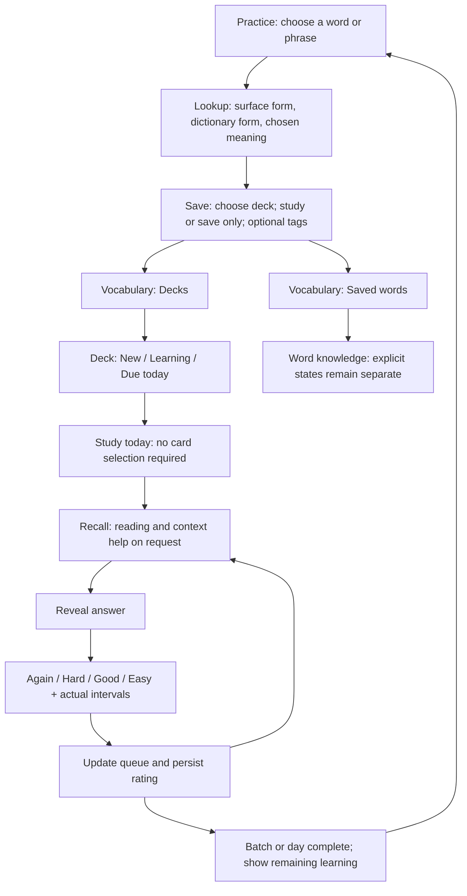

# Hibiki UX audit and implementation backlog

**Audit date:** 7 October 2026 (Europe/London).  
**Status:** Source audit complete; production browser testing blocked and still required.  
**Pull request:** https://github.com/JulianPJ/Shadowing/pull/35  
**Scope:** Documentation only. No application code, account configuration, scheduler state or deployment changed.

## Read this first / resume checkpoint

The user requested a live UX/interactivity audit of https://shadowing.julianpopovskijones.workers.dev/ and the lesson `/practice/youtube-kWl7muWnuM0`, using a disposable Pro account, followed by an agent-ready backlog by section. This document incorporates every starting note, corrects several assumptions against source, and records additional findings.

**Do not interpret this as a completed live test.** The Browser tool reported no available IAB session and an empty browser inventory. Computer Use found Chrome but stopped before page capture/input because it could not confidently determine the current browser URL. All computer input stopped. Neither account was signed into; no production card, playback, recording or sync operation was performed. Web text retrieval of the two production URLs returned a tool-level Internal Error: that is not evidence that the site itself is broken.

An asynchronous question asked whether an isolated Playwright browser could be used. No answer has been received at this checkpoint. Continue independent source work; do not treat silence as authorization for the alternate browser.

To resume:

1. Read this file, `PROJECT_CONTEXT.md`, `docs/architecture.md`, and applicable AGENTS instructions.
2. Use a working authorized browser. Credentials are in the original conversation only; never put passwords, cookies, tokens or auth screenshots in this file or PR.
3. Test the matrix below, add actual observations and screenshots with sensitive details removed, and upgrade evidence labels only after reproduction.
4. Update this same document/PR at each meaningful checkpoint. Do not create duplicate audit PRs.
5. Keep this PR documentation-only. Implement approved tasks in later PRs; preserve library facades and domain ownership. Do not merge or deploy automatically.

### Evidence and priority labels

- **C — Code-confirmed:** behavior/control structure directly verified in the inspected source. Does not prove which revision production runs.
- **R — Runtime reproduction:** isolated execution of a relevant code path, without the production UI.
- **U — User-reported:** supplied in the initial notes; not independently reproduced in the browser.
- **P — Proposal:** a concrete design improvement inferred from source/user needs. It is not a claim of an observed defect.
- **V — Live verified:** reserve this for a real browser reproduction. **There are no V findings in this pass.**

**P1:** core study reliability, misleading outcomes, major friction or inaccessible primary interaction.  
**P2:** navigation, comprehension, discoverability and usability polish.  
**P3:** later convenience/monetisation improvements.  
There is no verified production outage or P0 incident.

## Coverage ledger

| Area searched | Completed evidence | Live test remaining |
| --- | --- | --- |
| Product/architecture | PROJECT_CONTEXT.md and docs/architecture.md read | Compare deployed behavior with current main |
| Home/preparation | home.tsx, import entry/recovery flow | Requested URL preparation, cancel/retry, no-caption fallback |
| Library | my-library.tsx, library preview/restore flow | Continue, queue, pins, discovery and cold-cache loading |
| Practice/Studio | study-player.tsx, current-section.tsx, transcript-panel.tsx, media-youtube.tsx, layout/theme styles | Player, pause boundaries, seeking, Studio, all secondary panels |
| Lookup/save | japanese-text.tsx, dictionary-save.tsx, lexicon-definitions.tsx, dictionary validation/replay | Full-word click/hover, phrase selection, sense choice, save |
| Dictionary/decks/tags | personal-dictionary.tsx, review-entry-actions.tsx, tag-controls.tsx, decks/types.ts | Filters, create/manage collections, empty states, exports |
| Review | daily-review.tsx, review-scheduler.ts, review/client.ts, use-review.ts | Rating, intervals, Again return, today/overdue queues and persistence |
| Word Browser | word-browser.tsx, lesson-vocabulary.tsx | Search, bulk state, first dictionary download and offline behavior |
| Progress | learner-progress.tsx, weekly-report.tsx, completion summary | Empty/populated states, time boundaries, actionable recap |
| Account/Pro | account.tsx, auth-form.tsx, sync/client.ts, pro-feature.tsx | Supplied Pro login, entitlement, interrupted-task return, sync |
| Accessibility/responsive | relevant styles, dialog and shortcut implementation inspected | Keyboard, touch, 320–390px layout, 200% zoom, actual contrast |
| Competitors | Official Anki manual and Migaku Japanese feature page | No competitor accounts or live competitor usability tests |

**Source baseline:** local main `2b5e2b739cb17eb1de5c7fe8c2548208c4c17d38`, also the PR base at creation. The checkout was clean before the audit. The project context records B–D features merged and locally verified on 7 October; it explicitly separates production release. Do not assume every recently merged feature is deployed.

## Corrections to the starting notes

| Original concern | More precise task wording |
| --- | --- |
| No back button on Dictionary/Words/Account | These pages have a small HIBIKI home link. Add prominent, consistent Back to practice/navigation and preserve the previous learning context. |
| Awkward manual sync | Auto-sync already exists. Make automatic save/sync status reliable and understandable; keep manual retry as a secondary recovery action. |
| Unclear tags/decks | Both exist. Improve the interaction model and explanation, rather than rebuilding the capabilities. |
| Must select cards to review | Daily Review starts an enrolled due queue automatically; the extra selection is enrollment from saved vocabulary. Simplify save → enrollment and separate management from study. |
| Again 1m, Hard 6m, Good 10m, Easy 3d | These are requested examples, not current values. Current custom scheduler: Again 10m; first Hard/Good 1d; first Easy 4d. Show actual computed intervals. |
| All today's cards, like Anki | Anki normally observes due times and daily limits, with configurable learn-ahead and custom study. Hibiki's requested unrestricted same-day catch-up should be an explicit, clearly labeled option. |
| Hover selects 話 instead of 話せます | Source uses partial segments as hover/click targets. Reproduced in the default Intl.Segmenter path; solve meaningful word-span selection, including inflection and dictionary form. |
| White dictionary in Studio | Studio is dark independently of site theme, but secondary panels inherit paper/ink tokens. Source supports the cause; exact white-on-white rendering still needs live verification. |

## Backlog: 57 changes by section

Each item is a task boundary, not a requirement for one enormous implementation PR. Acceptance criteria describe the desired result. “P” items should be implemented as deliberate product choices, not silently reclassified as defects.

### 1. Shared navigation and terminology

**Owners:** `src/components/chrome.tsx`, standalone account/dictionary/review/words page components, responsive navigation styles.

**N1 — P1 · C/U/P: Give every learning page a clear return path.** Dictionary, Words, Review and Account currently substitute a small brand link for the shared Header. Use a consistent app shell with an explicit “Back to practice” or “Home” action. **Accept:** all four pages expose a visible return action; returning from a lesson preserves its section and playback position; account management does not strand the learner.

**N2 — P2 · C/P: Consolidate overlapping vocabulary destinations.** Navigation says Dictionary and Words; headings/actions also say Personal dictionary, My Words, Saved dictionary and Word Browser. Use one Vocabulary destination with Saved words, Decks, Review and Word knowledge views, preserving existing URLs through links/compatible routing. **Accept:** a learner can explain the distinction from the visible labels; saved contextual cards and known-word states remain distinct data concepts.

**N3 — P1 · C/P: Replace the long narrow-screen navigation row with an accessible menu.** Header contains account, review, library, progress, dictionary, words, help, theme and practice actions; CSS retains a flex row and reduces text/gaps at small widths. Overflow is a risk, not live verified. **Accept:** every destination is reachable at 320, 360 and 390px and at 200% zoom without page-wide horizontal scrolling; menu has a name, correct expanded state, keyboard support and focus restoration.

**N4 — P2 · C/P: Preserve the learning task through sign-in.** Email success and Google callback currently go to /account. Pass a validated internal return destination and restore the originating lesson, deck or review screen. **Accept:** “Sign in to save” returns to the same word/section with the intended action available; ordinary sign-in without a destination still has a sensible landing page.

### 2. Home and lesson preparation

**Owners:** `home.tsx`, `import-dialog.tsx`, media discovery/content-request domain modules.

**H1 — P2 · C/P: Explain supported links at the point of entry.** “Paste a Japanese video link” does not explain the automatic-caption versus transcript-import paths. Add short source/caption guidance beside the input. **Accept:** users can tell that YouTube may prepare automatically and other supported linked/local media may need subtitles before submitting; avoid promises of arbitrary streaming-site support.

**H2 — P2 · C/P: Give preparation failures a direct recovery action.** Current error actions are Import a transcript and Try the demo; resubmitting the main form is the implicit retry. Add a labeled retry beside the error, retaining the URL and any resolved metadata. **Accept:** network/provider failure, missing captions and unsupported content produce distinct messages/actions; Cancel and Retry are visibly separate; failures never discard the learner's input.

**H3 — P2 · C/P: Offer a compact returning-learner home.** Put Resume latest lesson and today's reviews ahead of repeated introduction/demo marketing once meaningful local/account history exists. LibraryPreview already exists; extend its hierarchy rather than duplicate it. **Accept:** returning learners can resume or start due review in one action; first-time users retain the clear link/demo entry.

**H4 — P2 · C/P: Treat URL preparation, queueing and imports as explicit alternatives.** Queue action appears after typing, while import/caption recovery share the entry area. Clarify “Practise now”, “Save for later” and “Use my media/subtitles”. **Accept:** the primary action is obvious; queue success is announced and visually neutral/successful; existing staged progress and cancel remain available.

### 3. Library and discovery

**Owners:** `my-library.tsx`, `library-preview.tsx`, `src/lib/library/`, `discovery-api.ts`.

**L1 — P2 · C/P: Make each lesson row actionable and easy to recognize.** Add compact source identity/thumbnail where available, a clear Resume/Practise again action and readable last-position/completion information. **Accept:** completed versus unfinished lessons have appropriate actions; source metadata is not fabricated for local files; a learner can identify the correct lesson without opening several titles.

**L2 — P2 · C/P: Distinguish synced lessons from device-only queue and pins.** The current intro explains local queue/saved choices, but nearby account restore entries can imply broader sync. Add concise section-level status and recovery actions. **Accept:** queue/pins say “On this device”; restorable lesson references say “From your account”; missing private transcript/local media has a targeted reattach path.

**L3 — P2 · C/P: Use different notice styles for success and failure.** Library notices, including “Saved to your queue”, use error-message styling. Give success, progress, offline and failure states appropriate appearances and live announcements. **Accept:** queue/save success does not look like a failure; errors include a useful retry or fallback.

**L4 — P2 · C/P: Make recommendation work and uncertainty understandable.** The code scans bounded prepared/public lesson candidates and may load morphology; cold-cache delay is unmeasured. Show meaningful loading stages, brief reasons and clear no-evidence/empty outcomes. **Accept:** starter videos stay labeled unprepared/fit unknown; no percentage appears without sufficient evidence; recommendations cannot block ordinary resume/queue use.

### 4. Main video practice and Studio

**Owners:** `practice/study-player.tsx`, `practice/current-section.tsx`, `practice/transcript-panel.tsx`, `japanese-text.tsx`, media adapters, `display-preferences.css`, `dictionary.css`, `drill.css`, `adaptive.css`, `theme.css`.

**P1 — P1 · U/C/R: Select the full meaningful Japanese form for lookup.** The default code uses Intl.Segmenter; a Node reproduction split 日本語を話せます。 into 日本語 / を / 話 / せ / ます / 。. Furigana and word-state paths use different token sources. Use one canonical lexical-span model for highlighting/lookup, expanding inflected predicates appropriately while preserving the exact surface sentence. **Accept:** clicking any part of 話せます offers that contextual form and the correctly resolved dictionary form; furigana/knowledge highlighting do not alter boundaries; manual phrase selection remains possible.

**P2 — P1 · U/C/P: Make every Studio surface and control theme-consistent.** Studio hardcodes dark surfaces/text while dictionary/secondary content uses root --paper/--ink; dictionary styles are imported after Studio styles. Establish scoped theme tokens for all Studio descendants and explicit surface/foreground pairs. **Accept:** lookup, inputs, sense actions, Save, drill controls, vocabulary, recap, quiz, difficulty, notices and disabled/hover/focus states remain readable in light-site + Studio and dark-site + Studio combinations, including mobile overrides.

**P3 — P2 · U/C/P: Give lower Studio tools a deliberate layout.** New vocabulary/follow-up/drill grid items sit alongside explicitly placed video/current/transcript areas; source supports the reported inconsistency. Keep video + current sentence as the dominant workspace, group mode/speed/sync controls, and place Transcript / Vocabulary / Lesson review in a clear secondary area. **Accept:** no orphan panels or large unexplained whitespace; primary playback actions remain visible; expanding a tool does not remount/reset the active player.

**P4 — P2 · C/P: Make transcript navigation and word lookup separate actions.** Current transcript rows are buttons that seek/play; their JapaneseText has highlighting but no lookup callback. Offer an explicit line-play action and a discoverable lookup/select affordance without nested interactive elements. **Accept:** looking up text never unexpectedly jumps playback; playing a row seeks to it; both paths work with keyboard and touch; auto-follow/search still work.

**P5 — P2 · C/P: Label playback position separately from completion.** Transcript checkmarks/past styling are based on index less than current index, and the top bar advances with the current section. Do not imply that jumping forward completed skipped lines. **Accept:** “Section 12 of 40” is position; practised/completed indicators use actual completion evidence; seeking and replay cannot fabricate completion.

**P6 — P2 · C/P: Make drills progressive rather than a wall of settings.** Mode controls and Focus/Continuous/Drill presets overlap; repeats, pause style, reveal timing and response duration add cognitive load. Start with a few described presets and put advanced overrides behind a settings disclosure. **Accept:** users can choose a listen/pause/repeat behavior without understanding every parameter; any customization is visibly represented; stop/continue remain unambiguous.

**P7 — P2 · C/P: Keep recording results and loss of recordings understandable.** Recordings clear on section change and diagnostics can be long; Studio right-column height is bounded and scrollable. Keep record/stop/replay/compare controls reachable and explain ephemeral recording behavior before leaving a recorded section. **Accept:** a user can replay native and own audio without finding buried controls; recorded audio is not silently presented as durable history; optional analysis never blocks the local A/B loop.

**P8 — P2 · C/P: Retain compact navigation and lesson identity in Studio.** Studio hides Header/Footer and title. Keep an explicit Exit Studio, lesson identity and compact access to Library/Vocabulary/Progress/Account that preserve player state. **Accept:** exiting restores the same lesson/section and a predictable layout; learners can reach review/account without guessing that the Studio toggle is the escape.

### 5. Lesson completion, comprehension and difficulty

**Owners:** `lesson-completion-summary.tsx`, `comprehension-quiz.tsx`, `lesson-difficulty.tsx`, `lesson-review-recap.tsx`.

**C1 — P2 · C/P: Turn lesson completion into a short next-step choice.** Recap, topic vocabulary, due review, quiz and difficulty accumulate below practice. Lead with completion, a compact result summary, and one recommended next action; disclose detailed evidence on demand. **Accept:** “Review saved words”, “Check understanding” and “Choose next lesson” are available without scanning a long report; “0 due” never presents a misleading primary review action.

**C2 — P2 · C/P: Preserve a clear return journey during quiz evidence replay.** Evidence banner/Return to question already exist. Make the active question, bounded replay and resume state obvious within the proposed secondary layout. **Accept:** replay returns to the same question/answer state; no quiz/regeneration/reset follows ordinary playback or display changes; unavailable evidence has a usable fallback.

**C3 — P2 · C/P: Replace technical difficulty copy with a brief explanation.** Current UI explains decision requests, chunking and caption timing. Lead with “Estimated level of this video”, level dimensions and a short estimate caveat, with methodology in details. **Accept:** users do not mistake content difficulty for their personal JLPT level; unavailable estimates remain retryable and never block practice.

### 6. Flashcards and Daily Review

**Owners:** `daily-review.tsx`, `review-entry-actions.tsx`, `src/lib/review-scheduler.ts`, `src/lib/review/`, `src/lib/decks/`. Scheduler changes belong in the review domain, not tags or per-view duplicated logic.

**F1 — P1 · U/C/P: Show the actual next interval on every answer button.** Current buttons only show Again/Hard/Good/Easy. Use a pure preview from the same scheduler/state/options that grading uses. Add shortcuts Space to reveal, 1–4 to grade and brief rating guidance. **Accept:** e.g. “Again · 1m” or “Good · 10m” appears only when those are the computed values; interval preview matches saved next due time; controls are unavailable before revealing.

**F2 — P1 · U/C/P: Implement explicit learning/relearning steps and an Anki-like study queue.** Current custom sm2-v1 sends first Hard/Good to 1d and Easy to 4d, while Again schedules 10m; grading always advances a fixed ID list. Add learning-step state, queue reentry and tested progression. Consider a maintained FSRS implementation for longer-term scheduling rather than an ad hoc imitation. **Accept:** an Again card can return during the same study session; new/learning/review counts are separate; refresh/offline resume preserves step and history; algorithm/version migration preserves existing cards and cross-device revision handling.

**F3 — P1 · U/C/P: Let users finish today's learning without an enforced wait.** dueReviews only includes dueAt <= now, and no special learning timer updates the page. Add a due countdown/automatic eligibility refresh plus explicit “Study remaining today now” or configurable learn-ahead. **Accept:** delayed same-day learning cards remain visible/reachable; due-now and due-later-today are distinguished; future-day reviews are not silently pulled forward; timezone/study-day boundary is defined.

**F4 — P2 · U/C/P: Start today's review without managing card checkboxes.** Daily Review already starts the enrolled queue; friction is the separate save/enroll step. Offer “Save and study” as a clear default/remembered choice with a Save only alternative. **Accept:** saving a chosen word can put it in the selected deck's new queue immediately; users can intentionally save reference-only vocabulary; daily study never requires selecting due cards individually.

**F5 — P2 · U/C/P: Add global and per-deck new/review daily limits.** Current 20-card cap is a session cap, not persisted new/review daily limits; Deck has no settings. Provide shared defaults, per-deck overrides and a today-only extension. **Accept:** 20-card batches may remain optional, but finishing a batch does not imply the day is finished; remaining backlog is visible; settings survive reload/sync; membership in multiple collections does not create duplicate schedules or double-count reviews.

**F6 — P2 · U/C/P: Add per-card reading/furigana control that supports recall.** Review always displays entry.reading and plain term/sentence text. Add independently revealable reading/furigana for term and source sentence with a session/deck default. **Accept:** help is not forced on the question side; changing one card's help does not grade it or reset the session; missing reading does not break review.

**F7 — P2 · U/C/P: Play context inside the card with minimize/close.** Daily Review opens the practice context in a new tab; Dictionary Open section navigates away. Provide a bounded inline source player or shared mini-player with a clear minimize action and a separate Open full lesson option. **Accept:** playback starts at the saved section and stops at its end; card/answer/session stay intact; minimize pauses audio; only one context source plays; local/private unavailable media has a clear reattach/open fallback. Use authorized provider playback; do not add media downloads.

**F8 — P2 · U/C/P: Separate context playback from opening the source website.** Use distinct labels “Play this section” and “Open on YouTube/Vimeo”, with space and external-link indication. Dictionary source actions currently share a 9px gap; review links are adjacent. **Accept:** neither control crowds the other at narrow widths; external navigation clearly opens separately; common replay is the primary action.

**F9 — P2 · C/P: Make session completion truthful and resumable.** Current completion says Review complete after a fixed batch even when Again is due later or additional due cards remain. Add remaining-now, learning-later-today and daily-limit state, plus Continue review/Pause. Add correction/undo-last-rating support with appropriate operation/revision semantics. **Accept:** mistaken taps can be corrected without corrupting server history; leaving/returning does not lose the study position; batch finished and day finished are different outcomes.

**F10 — P2 · C/P: Handle cold loading, unavailable cards and sync conflict as different states.** Card hydration is limited to 20 and the unavailable-card branch can say no longer available while material is still loading. Show loading before missing; expose retry/skip only for the correct condition. **Accept:** offline cached cards remain usable; unresolved entries do not make a due queue disappear; a conflict restores authoritative schedule with a clear next action and does not pretend an unsynced grade succeeded.

### 7. Saved vocabulary, decks and tags

**Owners:** `personal-dictionary.tsx`, `dictionary-save.tsx`, `tag-controls.tsx`, `src/lib/dictionary/`, `src/lib/decks/`, `src/lib/tags/`.

**D1 — P2 · U/C/P: Make Decks a dedicated view.** Deck creation/filtering is buried among search, tags, enrollment and exports; every word renders all deck checkboxes. Provide deck rows with name, new/learning/due counts and Study/Browse/Settings actions. **Accept:** users can inspect an empty or populated deck, start its day's study and manage it without opening card-selection tools; deck assignment scales beyond a few decks.

**D2 — P2 · U/C/P: Explain Inbox and the collection model.** Saving creates default Inbox membership while review enrollment is separate. Rename to “Unsorted” or explain “Default collection for newly saved words”. Explain whether collection assignment adds or moves membership. **Accept:** a user knows where a new word went and whether it will be studied; moving/removing a collection does not duplicate/reset a word's schedule; tags remain descriptive metadata.

**D3 — P2 · C/P: Make bulk organization independent of the active deck filter.** “Add selected to deck” appears when that target deck is selected, but selection is limited to current query entries; switching to an empty destination can lose usable selection. Add explicit destination picker/Move or Add actions above the selected set. **Accept:** select words in All words and assign to any empty/existing deck without changing the filter; cross-page selection scope is stated; rename/delete has clear effects and recovery/confirmation.

**D4 — P2 · U/C/P: Put tag creation/application in the natural save/manage flow.** Existing tag creation/rename/apply explanation lives in collapsed details; per-card “+ tag” only selects existing tags. Allow visible “Add tag” with search/Create tag and recent examples; keep advanced global management separate. **Accept:** users can create and apply a tag while saving a word or managing selected words; removing a tag is reversible where feasible; no new schedules are created by tags.

**D5 — P1 · C/P: Permit saving a valid word without a successful sentence translation.** Save currently requires meaning and sentenceMeaning, and domain validation also requires sourceSentenceTranslation. Make sentence English optional or provide an explicit untranslated-context save path with coordinated schema/API validation. Keep original Japanese context mandatory. **Accept:** dictionary/network translation failure does not prevent saving a valid lexical entry; existing entries remain readable/exportable; unsupplied English is labeled rather than fabricated.

**D6 — P1 · C/P: Preserve exact context and correct dictionary browsing states.** Review uses reviewContextHref with transcript fingerprint; dictionary Open section omits it. Use a shared revision-aware link/player path. Also distinguish truly empty dictionary from no results in a deck/tag/search, and improve search beyond exact term through bounded domain queries. **Accept:** changed transcripts never silently replay the wrong saved sentence; no-match shows Clear filters/Search help instead of “No saved vocabulary yet”; partial Japanese/reading/meaning search can find expected entries; export scope is explicit and delete is protected by Undo or clear confirmation.

### 8. Word knowledge / Word Browser

**Owners:** `word-browser.tsx`, `word-state-controls.tsx`, `lesson-vocabulary.tsx`, `src/lib/knowledge/`, `src/lib/lexicon/`.

**W1 — P2 · C/P: Explain word knowledge separately from saved cards.** A learner can mark Known without saving a card, and review does not silently mark Known. Show concise Unknown/Learning/Known/Ignored definitions and links between the two views. **Accept:** controls state exactly what changes; “Ignored” is not confused with deletion; recall ratings never unexpectedly override explicit knowledge.

**W2 — P2 · C/P: Replace implementation labels with learner actions.** “Look up in JMdict”, “bulk knowledge states”, morphological shards and download mechanics dominate some copy. Use “Look up a word”, “Mark selected words”, and “Find words in recent lessons”, while retaining license attribution and honest download information in secondary help. **Accept:** first analysis has a clear loading/retry state and brief download notice; cached/offline behavior is understandable; local analysis never blocks the player.

**W3 — P2 · C/P: Make bulk marking and vocabulary coverage interpretable.** Clearly state selection scope and what a percentage counts; explain recommended lines with an action rather than only counts. **Accept:** Select all visible differs from all matching; changing filters handles selection predictably; Known percentage remains labeled vocabulary coverage/marked Known, not comprehension or certified ability.

### 9. Progress

**Owners:** `learner-progress.tsx`, `weekly-report.tsx`, `src/lib/reports/weekly.ts`, learner profile/persistence modules.

**G1 — P1 · C/P: Turn attention moments and quiz history into practice actions.** “Moments that needed more attention” and comprehension history currently contain text only. Add Replay section, Resume check and Retry check where evidence permits. **Accept:** the action reaches the relevant lesson/section/question; unavailable original transcript has recover/reprepare guidance rather than an unusable link.

**G2 — P2 · C/P: Lead with a small useful summary and one next step.** Weekly report currently appears before the empty-progress state and multiple history panels. Show this week's active practice, optional daily goal and a concrete Resume/Review action; disclose detailed histories. **Accept:** first use explains how to get useful data; populated state answers “What should I do now?” without requiring interpretation of every counter.

**G3 — P1 · C/P: Use one explicit learner study-day boundary.** Weekly/daily report uses UTC, while user locale/browser dates are local. Use an account/device timezone and defined rollover consistently across review limits, goal and weekly report. **Accept:** late-evening Europe/London activity lands on the expected day; DST/timezone changes do not double-count; stored event timestamps remain UTC and evidence is not rewritten.

**G4 — P2 · C/P: Label partial and self-rated metrics where they appear.** “Saved terms in device cache” is a bounded cache, recall counts Good/Easy only, and Match is recognition/timing. Present “Cached saved words”, “Self-rated recall” and “Speech recognition match” with sample counts/range nearby. **Accept:** cache eviction is not presented as lost learning; Hard's treatment is explained; no metric claims proven memory gain or pronunciation skill.

**G5 — P2 · C/P: Make content-range and trend prerequisites helpful.** Five analyzed lessons are needed for typical content; ten for trend. Show current eligible count, a simple next action and keep detailed methodology optional. **Accept:** learners can tell why the chart is empty; content difficulty remains clearly distinguished from personal ability; daily goal is editable without deleting/recreating it.

### 10. Account, sync and Pro

**Owners:** `account.tsx`, `auth-form.tsx`, `pro-feature.tsx`, learner/review/knowledge sync modules.

**A1 — P2 · U/C/P: Use a useful compact account surface.** Current standalone page mostly shows email, plan, methods, sync and sign-out. Prefer an account drawer for routine tasks, with a full settings page if needed. **Accept:** close/back returns to the learning task; plan, sync, sign-in methods and learning settings are easy to find; no decorative filler is added merely to fill the page.

**A2 — P1 · U/C/P: Show aggregate and honest automatic sync status.** Auto-sync already starts globally, but Account reports general learner sync while review and knowledge use independent channels; its default branch says “Your progress is synced”. Show Saved on this device, Syncing, Synced, Pending and Needs attention using all relevant channels. **Accept:** a pending review/knowledge change cannot coexist with an unqualified all-data-synced claim; last successful sync and retry are visible; local practice remains usable.

**A3 — P1 · C/P: Distinguish offline from auth/server/conflict errors.** General sync catches failures as offline. Give accurate recovery states and preserve local changes; make import/device-history choice clear after sign-in. **Accept:** online server failures do not tell users to reconnect; expired sign-in offers reauthentication back to the task; import choice explains scope and cannot erase anonymous history unexpectedly.

**A4 — P2 · C/P: Explain Pro entitlements and provide a useful next action.** Account currently shows a plan badge; a signed-in Free user hitting a Pro notice gets no action. Add a readable feature/limit comparison and a truthful access/upgrade path appropriate to current billing availability. **Accept:** Pro features are distinguishable before interaction; Pro users are not shown Free upsells after loading; do not advertise a checkout/subscription management flow until it exists.

**A5 — P2 · C/P: Make sign-in/provider state part of normal product language.** Disabled Google/configuration messages and verification controls expose deployment details. Show only available methods or a concise temporary-unavailability message; show resend verification when relevant to that account. **Accept:** ordinary sign-in has clear pending/error states and password visibility control; unavailable registration/recovery has a working alternative; return-to-task follows N4.

### 11. Accessibility, responsive behavior and failures

**Owners:** shared styles/components and individual domain error/recovery paths. These acceptance criteria apply to every section above.

**X1 — P1 · C/P: Increase readability and effective touch targets.** Dictionary help/labels/errors use 8–11px; save button can be 34px high; mobile CSS reduces some labels further. Establish a readable scale and adequately sized effective targets. **Accept:** essential copy stays legible at normal zoom; text contrast meets WCAG AA (4.5:1 normal, 3:1 large), interactive component contrast meets applicable 3:1 requirements; touch targets approach 44px without overlap; browser zoom does not clip primary actions.

**X2 — P1 · C/P: Verify full keyboard and touch journeys.** Japanese token spans support keyboard buttons, but phrase selection uses mouseup; long text can create many focus stops. Provide touch-compatible phrase selection and a practical focus model for lookup. **Accept:** choose/play/lookup/save/reveal/grade and every dialog work without a mouse; focus is visible, trapped only for modal dialogs and restored on close; shortcuts do not hijack input/select/contenteditable interactions.

**X3 — P2 · C/P: Use task-specific empty/loading/failure states.** Audit empty dictionary/filtered deck, zero reviews, delayed learning, missing transcripts, failed lookup, denied recording and provider failure separately. **Accept:** each state explains what happened and offers the relevant next action; loading is never mislabeled as permanent absence; audio playback and local work continue when optional AI/network tasks fail.

**X4 — P2 · C/P: Make long operations and save results observable.** Provide visible pending/saved status and an appropriate polite announcement, prevent duplicate submits/grades, preserve typed work on failure, and put recovery beside the action. **Accept:** learner can tell whether a word/card/rating/queue operation succeeded; no race produces multiple copies from a double tap; error text is readable in all themes.

**X5 — P2 · C/P: Validate responsive layout as a journey, not isolated screenshots.** Test Studio's height/overflow, the long header, dictionary/deck toolbar, review controls and recording diagnostics together. **Accept:** 320/360/390/768/1280+ widths, landscape and 200% zoom have no clipped primary actions or accidental page-wide scrolling; independent panes have intentional scrolling; reduced-motion preference remains respected.

## Proposed interaction visuals

These are finalized **interaction structures**, not approved pixel-perfect designs or screenshots of existing UI. Keep the visual styling consistent with Hibiki during implementation.

### Vocabulary structure and study flow



### Studio workspace

```text
┌─────────────────────────────────────────────────────────────────────┐
│ Back to practice · Lesson title        Vocabulary  Account  Exit     │
├──────────────────────────────────────────┬──────────────────────────┤
│                                          │ Current Japanese section │
│                  VIDEO                   │ reading / translation    │
│                                          │ Replay   Listen/Continue │
│                                          │ Record · Listen · Compare│
├──────────────────────────────────────────┴──────────────────────────┤
│ Preset: Focus / Continuous / Drill     Speed    Subtitle sync        │
│ Advanced settings ▾                                                   │
├─────────────────────────────────────────────────────────────────────┤
│ Transcript      Vocabulary      Lesson review                         │
│ Active pane: searchable lines OR recommended words OR recap/check    │
└─────────────────────────────────────────────────────────────────────┘
```

On mobile: video → current sentence/controls → compact recording → selected secondary pane. Keep one mounted player and preserve lesson position through all display changes. If tabs are used, do not recreate the media tree on tab selection.

### Review card

```text
Back to Decks                     Travel · 3 new / 2 learning / 8 due
                         話せます
                   [Show reading] [Play context ▾]
                  [Reveal answer · Space]

After reveal:
Dictionary form · chosen meaning · exact Japanese source sentence
[Inline bounded player when opened] [Minimise] [Open full lesson]
[Open source website ↗]

[Again · computed] [Hard · computed] [Good · computed] [Easy · computed]
       1                  2                 3                4
[Undo last rating]                                   [Pause study]
```

Interval strings above are placeholders from the scheduler, not hardcoded 1m/6m/10m/3d values.

## Competitor references and what to borrow

This pass uses primary documentation and advertised interactions. It does **not** establish competitor commercial success or compare live performance.

- [Anki: Studying](https://docs.ankiweb.net/studying.html) supports deck-led recall/reveal/rate study. Borrow the clear separation between management and study; keep authentic source context in Hibiki.
- [Anki: Deck Options](https://docs.ankiweb.net/deck-options.html) supports shared presets, per-deck/today-only limits and learning/relearning steps. With example steps 1m/10m, initial Hard can be 6m. Intervals vary with settings/card state; Anki's normal learn-ahead is bounded, so the user's all-today request needs explicit Hibiki behavior. Consult current FSRS guidance before changing scheduling.
- [Anki: Preferences](https://docs.ankiweb.net/preferences.html) is the configuration reference for learn-ahead. The page was opened; detailed follow-up retrieval failed, so the 20-minute default cited here is supported by the successfully read Deck Options page.
- [Migaku: Learn Japanese](https://migaku.com/learn-japanese) advertises word lookup, one-click cards carrying sentence/media context, cross-device review and explicit vocabulary-informed content fit. Borrow the low-friction lookup-to-card journey and contextual study pattern. This does not authorize downloading copyrighted media or expanding sources ahead of the project roadmap.
- Language Reactor homepage/search was attempted but produced no substantive extractable official guidance; no specific competitor claim relies on it.

## Suggested implementation order

1. **Reliable core loop:** P1/P2 (word spans/themes), D5/D6 (save/context correctness), F1/F2/F3/F10 (review queue/intervals), A2/A3 (truthful sync), G3 (study-day boundary), X1/X2.
2. **Discoverable vocabulary workflow:** N1/N2/N3/N4, D1/D2/D3/D4, F4/F5/F6/F7/F8/F9.
3. **Practice polish:** P3–P8, C1–C3, home/library hierarchy, word-state clarity, actionable Progress.
4. **Account and monetisation presentation:** A1/A4/A5 after the core learning loop is comfortable. Billing implementation remains a separate approved task.

Within each group, validate live findings and existing features first. Do not replace working caption infrastructure, add new media providers, infer formal learner ability from activity, or duplicate review schedules in tags/decks.

## Required live validation matrix for the next pass

Use disposable test data in the supplied test account. Keep a small audit deck/tag and record their names in this document; do not alter real learner data or start paid transactions.

| Journey | Required checks / evidence |
| --- | --- |
| Cold start | Open requested practice link before prep/sign-in; record missing/restored lesson behavior; prepare the supplied YouTube URL via Home |
| Pro | Sign in, confirm actual Pro badge and analysis access; capture return path; exclude credentials from evidence |
| Playback | Listen → automatic pause → Continue; replay/prev/next; speed; continuous; keyboard; seek a nonadjacent section |
| Studio | Toggle with playback active; lookup/sense/save panel; drill/vocabulary/quiz/difficulty/recap; verify four theme/layout combinations |
| Japanese lookup | 話せます or comparable inflected predicates, nouns, compounds, particles, furigana on/off, word states empty/populated; mouse and touch phrase selection |
| Card creation | Select sense; save with/without sentence translation; select deck/tag; test duplicate save and provider failure recovery |
| Collections | Empty and populated deck; create/rename/assign/move/remove; tags; partial/exact searches; filtered zero-result copy; pagination/export scope |
| Study | Reveal, four ratings and actual intervals; Again reentry, day backlog, delayed learning, >20 due cards, exit/resume, offline pending grade and conflict |
| Progress | Empty/new/populated history, replay moments, quiz resumption, goal, local study-day rollover, sample/partial-cache labels |
| Account/sync | Automatic save after local work, offline/reconnect, review/knowledge pending versus Account claim, first-login import choice, sign-out scoping |
| Media fallback | Missing Japanese captions, unsupported/removed video, changed transcript, local media reattach, autoplay blocked |
| Accessibility | Keyboard-only journey, tab order, dialog Escape/focus return, input-safe shortcuts, denied microphone, 200% zoom, reduced motion |
| Responsive | 320/360/390/768/1280+ widths, landscape, long Japanese/English, full lookup and recorded-result expansion |
| Optional Free contrast | Free account/basic anonymous flow to confirm paid notices do not hide free memory/word-state features |

Record steps, actual result, expected result, source/deployed revision when known, viewport/theme, severity and whether the problem survives reload. Compare actual deployment against baseline before removing a recommendation because it exists in main.

## Search and work log

- **Checkpoint 0:** Read project context/architecture; inspected repository metadata and clean local HEAD. Created audit branch, initial document and draft PR #35.
- **Checkpoint 1:** Browser IAB unavailable and inventory empty. Initialized computer-use fallback, found Chrome, attempted initial state capture; tool stopped on URL-verification policy before UI access. Stopped input. Reviewed review scheduler/queue, dictionary/decks/tags, account and sync, Japanese text and theme ownership. Opened Anki/Migaku references.
- **Checkpoint 2:** Reproduced Intl.Segmenter boundaries with Node: 日本語 / を / 話 / せ / ます / 。. Reviewed source save validation, transcript replay fingerprint mismatch, auth return route, Studio lower layout, Progress actions, weekly metric/time boundaries and Library notices. Updated remote document again.
- **Checkpoint 3:** Completed source-only 57-item backlog, acceptance criteria, interaction diagrams and implementation ordering. Live test matrix remains pending; no production interactions or login were completed. Documentation review is the verification for this PR; application tests/builds are unnecessary because application code is unchanged.

### Source map for future agents

All paths refer to the baseline commit. Use [the repository at the audited revision](https://github.com/JulianPJ/Shadowing/tree/2b5e2b739cb17eb1de5c7fe8c2548208c4c17d38).

- Product/compatibility: `PROJECT_CONTEXT.md`, `docs/architecture.md`, `docs/post-mvp-phases-b-d.md`.
- Navigation/home: `src/components/chrome.tsx`, `home.tsx`, `import-dialog.tsx`, `library-preview.tsx`, `src/app/layout.tsx`.
- Practice: `src/components/practice.tsx`, `practice/study-player.tsx`, `practice/current-section.tsx`, `practice/transcript-panel.tsx`, `media-youtube.tsx`, `voice-recorder.tsx`.
- Lookup: `src/components/japanese-text.tsx`, `dictionary-save.tsx`, `lexicon-definitions.tsx`, `src/lib/dictionary/validation.ts`, `dictionary/replay.ts`, `dictionary/repository.ts`.
- Study/collections: `src/components/daily-review.tsx`, `personal-dictionary.tsx`, `review-entry-actions.tsx`, `tag-controls.tsx`, `use-review.ts`, `src/lib/review-scheduler.ts`, `review/client.ts`, `review/types.ts`, `decks/types.ts`.
- Knowledge: `src/components/word-browser.tsx`, `word-state-controls.tsx`, `lesson-vocabulary.tsx`.
- Progress/completion: `src/components/learner-progress.tsx`, `weekly-report.tsx`, `lesson-completion-summary.tsx`, `lesson-difficulty.tsx`, `comprehension-quiz.tsx`.
- Account: `src/components/account.tsx`, `auth-form.tsx`, `pro-feature.tsx`, `src/lib/sync/client.ts`.
- Styling/cascade: `src/app/globals.css`, `styles/base.css`, `responsive.css`, `practice-layout.css`, `display-preferences.css`, `dictionary.css`, `theme.css`, `drill.css`, `adaptive.css`.
